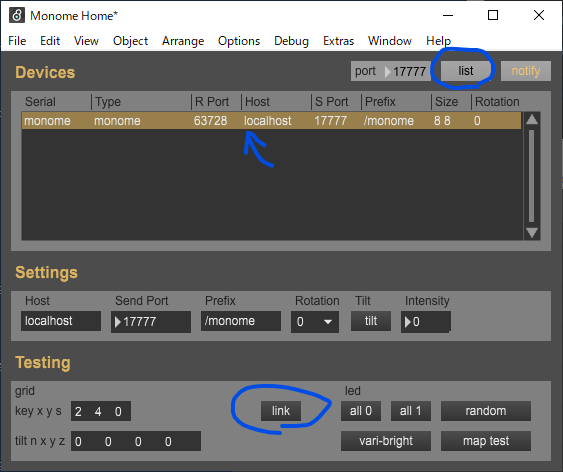
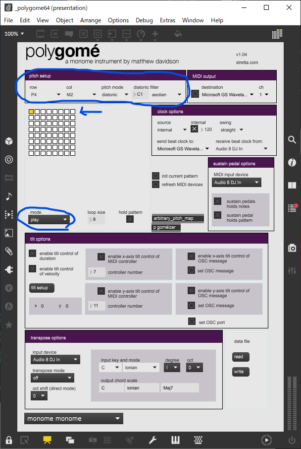

Feuille64-GRID tutorial
==========================================
Feuille64をmonome grid cloneとして動作させるためのファームウェアです。

主にwindows上での使用方法を説明しています。

## Fueille64について
[◤◢◤◢◤◢◤◢](https://twitter.com/yynmt_/)さんの開発した最高のデバイスです。

Feuille64というMIDIパッドを作った   
https://yynmt.hatenablog.com/entry/2021/08/19/024232

## Feuille64へファームウェアを書き込む
**まだバグや最適化が終わっていない部分があります。想定しない動作をするかもしれません。**

ビルド済みのファームウェアを用意しています。

https://github.com/hsgw/feuille64_grid/releases/latest   
zipファイルをダウンロードして、中のhexファイルをQMK Toolboxなどで書き込みます。

書き込み後、Feuille64はUSB-Serial(CDC)デバイスとして認識されます。   
デバイスマネージャなどで認識されていることを確認して、ポートの名前をメモしておいてください。

## 必要なソフトウェアをインストールする
### Max 8

Max 8をインストールします。   
ユーザー登録などをしなくても保存が出来ない機能制限版として動作します。

https://cycling74.com/downloads

### node-serialoscd
Feuille64-GRIDとアプリケーションを繋ぐためのブリッジ用ソフトウェアです。

#### nodeをインストールする

Windows での NodeJS のインストール   
https://docs.microsoft.com/ja-jp/windows/dev-environment/javascript/nodejs-on-windows

これを参考にしてnvmをインストールして、
```ps
> nvm install 12.22.6
> nvm use 12.22.6

> node -v
v12.22.6
```
を実行し、v12.22.6をインストール・有効化します。   
(古いバージョンなのはserialportのコンパイルを避けるためなので分かっている人はよしなにしてください)

##### node-serialoscdのカスタマイズ版をインストールする

windows上で動作するように改造したものを用意しています。

https://github.com/hsgw/node-serialoscd

```ps
> git clone https://github.com/hsgw/node-serialoscd
> cd node-serialoscd
/node-serialoscd> npm install
```

エラーなく終了すれば実行環境が整っています。

Feuille64-GRIDを接続した状態で
```ps
/node-serialoscd> npm start {メモしたシリアルポートの名前(COM3など)}

// デバッグメッセージ付き
/node-serialoscd> node index.js {メモしたシリアルポートの名前(COM3など)} -d
```
で、実行します。

### monome_home.maxpatで動作確認
https://github.com/monome-community/monome-home

ここからZIPファイルをダウンロードして解凍し、`Monome Home.maxpat`をダブルクリックで実行します。



上の`list`をクリックするとデバイスリストが更新されます。   
リストからデバイスを選択すると、`Testing`の項に押したスイッチの場所などが表示されるようになります。

`link`を押すと押したスイッチの場所のLEDが光るようになります。

問題なく動作するか確認してください。

### polygomeで遊ぶ
高機能なアルペジエーターアプリケーションのpolygomeで遊びます。   

https://github.com/monome-community/polygome

zipファイルでダウンロードして
`polygome_64_105`内の`_polygome64.maxpat`をダブルクリックで実行します。   



この状態で一番上の行でないスイッチを押すとLEDが光って音が鳴ります。

#### 使い方
- 一番上の行はパターンの切り替え
- アプリケーション上のmodeを切り替えるとパターン設定を変更できる。   
  - `record`は、パターン自体を変更します。順番にボタンを押して設定します。
  - 他は適当に試してみてください。
  - `play`に戻すと演奏モードです。

### 他のアプリケーション
この辺にあります。   
動作速度の都合かうまく動かないものもあるかもしれません。

https://monome.org/docs/grid/grid-computer/
